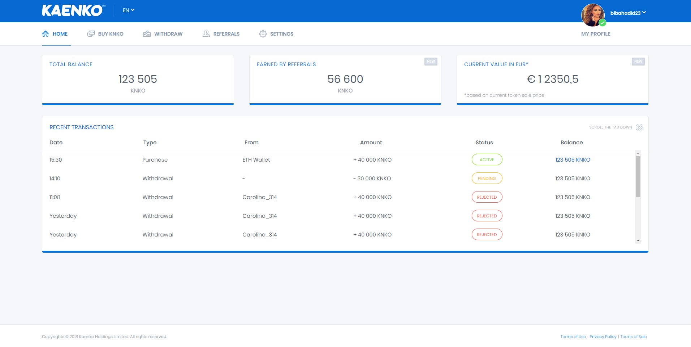
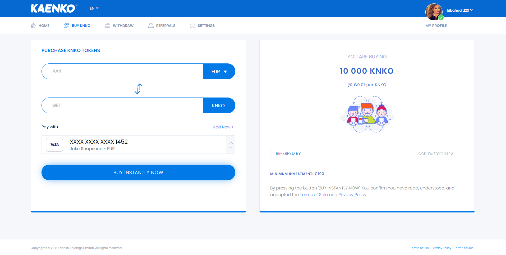
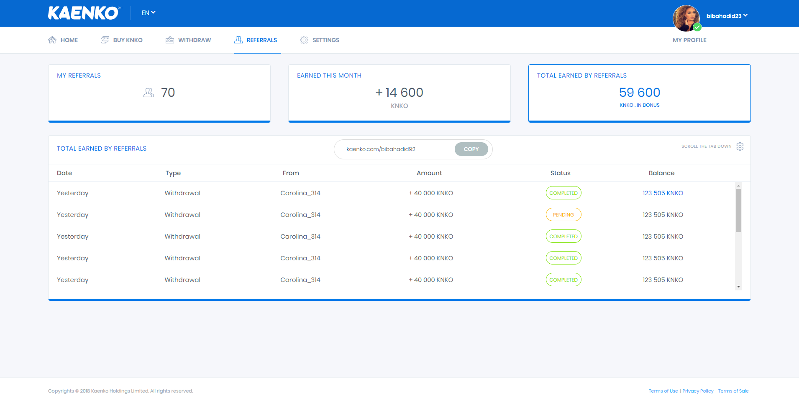
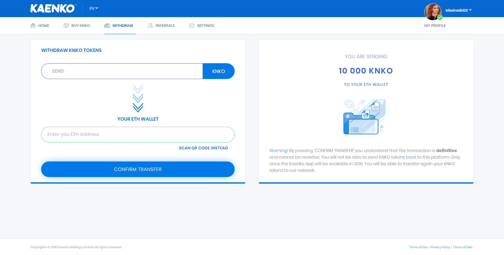

<p align="center">
  
</p>
# kaenko

This project is built by Angular CLI 5.2.0.

## Getting Started

### Screenshots






### Prerequisites

```
NPM 6.0+
Node 8.0+
Angular CLI 5.2.0+
```

### Installing

```
npm install
```

### Running the Tests

```
npm start
ng serve --open
```

### Building

```
npm build
```

## Versioning

0.0.1

## License

MIT

## Authors

